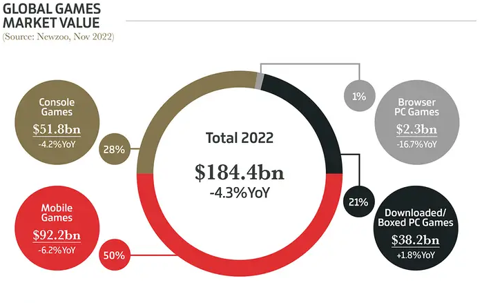
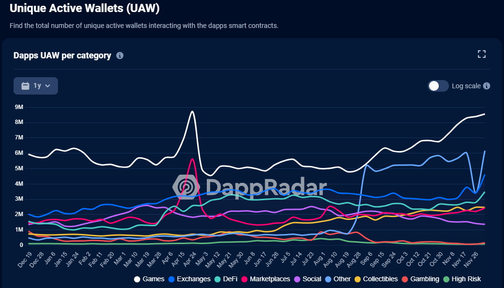
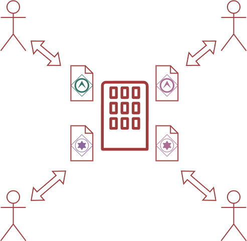
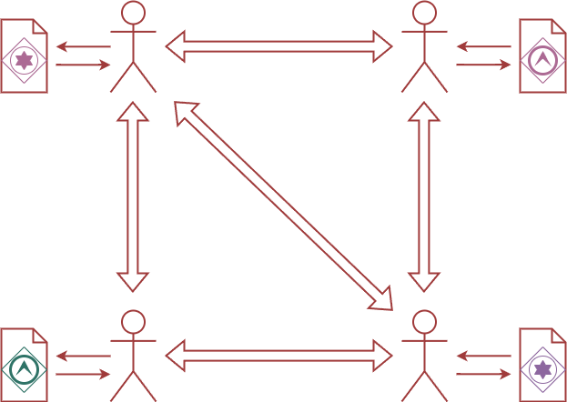

# Применение технологий блокчейна в игровой индустрии
Статью следует начать с краткого введения в курс происходящего. Мы быстро познакомимся с технологией блокчейн и игровой индустрией, а также рассмотрим, как эти две сферы соединяются вместе. И попробуем придумать новое применение блокчейна в играх.
## Определение технологии блокчейн
Блокчейн (Blockchain) — это распределенная база данных, которая хранит информацию в виде блоков, каждый из которых содержит информацию о предыдущем блоке. Блокчейн использует криптографические методы для обеспечения безопасности и целостности данных. \
Особенности технологии блокчейн:
1.	***Децентрализация / Распределенность*** - блокчейн хранится на множестве устройств, что делает его более надежным и устойчивым к атакам.
2.	***Прозрачность*** - все транзакции в блокчейне являются публичными и могут быть просмотрены всеми участниками сети.
3.	***Невозможность изменения данных*** - блокчейн использует криптографию для обеспечения безопасности и целостности данных, что делает невозможным изменение информации в блоке.

Область применения технологии блокчейн на сегодняшний день охватывает множество различных сфер. От финансового сектора и цифровых активов до управления поставками и медицинской документации, блокчейн стал основой для целого ряда инноваций и практически стал технологией с общим применением. \
Рассмотрим некоторые из самых захватывающих областей, где технология блокчейн нашла применение:
1.	***Финансовые услуги и цифровые*** активы: Блокчейн революционизировал финансовый сектор, обеспечивая безопасные и прозрачные транзакции, разработку цифровых валют (таких как Bitcoin и Ethereum) и создание новых форм финансирования, включая ICO и DeFi (децентрализованные финансы).
2.	***Управление поставками и логистика***: Блокчейн позволяет отслеживать поставки, управлять цепями поставок и обеспечивать учет происхождения товаров. Это улучшает прозрачность и доверие в цепи поставок.
3.	***Здравоохранение и медицинская документация***: В медицинской сфере технология используется для безопасного и эффективного обмена медицинской информацией, управления медицинскими записями, а также обеспечения целостности истории болезни.
4.	***Интеллектуальная собственность и авторские права***: Блокчейн обеспечивает защиту интеллектуальной собственности, а также создает инфраструктуру для учета прав на цифровые активы, авторские права и лицензии.
5.	***Голосование и демократия***: Технология блокчейн может использоваться для обеспечения прозрачности в выборах, голосованиях и процессах участия общественности.

## Обзор игровой индустрии
Сегодня игровая индустрия является одной из самых динамично развивающихся отраслей мировой экономики. Ежегодно на рынок выходят сотни новых игр, которые привлекают внимание миллионов геймеров по всему миру.

Одним из главных трендов последних лет стало увеличение количества мобильных игр. Смартфоны и планшеты стали настоящими игровыми платформами, на которых можно играть в любое время и в любом месте. Большинство крупных игровых компаний уже выпустили свои хиты на мобильные устройства, а некоторые даже перешли полностью на эту платформу.

Также нельзя не упомянуть рост популярности онлайн-игр. Многие игры уже перешли в онлайн-формат, что позволяет игрокам со всего мира играть вместе и соревноваться друг с другом. Это создает огромные возможности для разработчиков и издателей, которые могут получать доход от продажи игр, а также от продажи внутриигровых предметов и услуг.

Наконец, стоит отметить, что игровая индустрия не только развлекает людей, но и является важным экономическим фактором. Она создает рабочие места, привлекает инвестиции и способствует развитию технологий. Безусловно, игровая индустрия будет продолжать расти и развиваться, привлекая все большее количество геймеров и инвесторов.

Согласно последним отчетам DappRadar, на игры приходится большая часть активности dApp во всех блокчейнах. Этот рост может быть связан с увеличением числа игр на основе блокчейна и повышенным интересом к ним со стороны пользователей.

## Применения блокчейн технологий в играх
Геймеры привыкли тратить реальные деньги на различные внутриигровые продукты: персонажей, оружие, внутриигровую валюту и т. д. Эти покупки идут разработчику игры, централизованному юридическому лицу, и на самом деле не дают фактического права собственности на эти внутриигровые продукты. игровые предметы игроку.

Более того, если вы полностью прекратите играть в эту игру, все собранные вами орудия, инструменты и приспособления станут для вас абсолютно бесполезными. В других играх они не будут работать, и вы не сможете продать или сдать их в аренду, не нарушив лицензионное соглашение (EULA) между игроком и разработчиком игры, которое может содержат ограничения в продажи и передачи игровых аккаунтов.

Как раз эту проблему помогает решать блокчейн. Он может помочь создать более прозрачный игровой рынок. Используя смарт-контракты, игровые компании могут обеспечить безопасное и прозрачное выполнение транзакций. Смарт-контракты позволят пользователям просматривать детали каждой транзакции и быть уверенными в том, что эти транзакции являются подлинными и безопасными. Это помогло бы предотвратить мошенничество и гарантировать, что геймеры получат то, за что они платят.

В играх, использующие блокчейн, персонажи и предметы отображаются как NFT и могут быть куплены, проданы и обменены, как и любой другой невзаимозаменяемый токен. Это дает игрокам истинное право собственности на свои активы.

Кроме того, блокчейн может помочь сократить операционные расходы игровых компаний за счет оптимизации процесса оплаты. Используя криптовалюту, геймеры могут совершать платежи мгновенно и безопасно, устраняя необходимость в сложных системах обработки платежей. Это помогло бы снизить эксплуатационные расходы и сделать игровой процесс более удобным.

## Возможные новые способы использования
С ростом популярности имеется потребность в новых и инновационных стратегиях монетизации для новой аудитории. Технология блокчейн предоставляет разработчикам уникальную возможность исследовать новые способы монетизации игр и создавать новые источники дохода.

Благодаря блокчейн-механике, применив которую к игровым активам, может обеспечить отделение ценности игрового предмета от конкретной игры. Например, для ***штурвала корабля*** (внутри игровой предмет в игре про пиратов) это означает, что информация о нем записывается в блокчейне, а не ограничивается одной игрой. Последующие блокчейн-игры, такие как **A** (симулятор кораблей), **B** (симуляторы рыбалки) или **C** (приключенческая игра в пиксельном стиле), которые реализуют поддержку этого актива, могут обнаружить его наличие у пользователя и предоставить возможность использовать его в своей собственной игровой среде. Таким образом, обладатели ***штурвала*** смогут использовать их в рамках различных игр, что подобно тому, как персонажи или предметы могут существовать в различных вселенных или в рамках мультивселенной.

Это действительно увлекательная идея, каким образом блокчейн изменяет понятие владения и обмена игровыми активами. Такой подход может создавать уникальный ***метавселенный*** опыт для игроков, где активы приобретают персистентную ценность в различных игровых контекстах.

## Пример использования мета вселенных
В контексте разработки игр часто возникает проблема обеспечения игроков необходимыми ресурсами для успешного прохождения игры. Одним из решений этой проблемы может быть создание общего виртуального рынка, где игроки одной игры могут покупать и продавать ресурсы, которые в их игре добыть невозможно. Такой подход может стимулировать приток новых игроков и покупку внутриигровых улучшений (бустов).

Например, в игре **А** у игрока есть возможность собирать чертежи улучшений для кораблей, а также необходимые материалы. Буст корабля может помочь игроку быстрее прокачиваться и исследовать внутриигровой мир. Однако, данная модернизация корабля может занимать продолжительное количество времени. В таком случае, игрок может зайти в другую игру **С**, где он сможет найти мастера, который сможет продать ему ускорение модернизации (например, какое-либо пособие 😊 ). После этого, игрок переносит это ускорение в свою первую игру и использует его.

Таким образом, общий виртуальный рынок позволяет игрокам получать необходимые ресурсы в одной игре, играя в другую, а также стимулирует покупку внутриигровых бустов. Важно правильно настроить экономику игр и систему обмена ресурсами на общем рынке, чтобы создать здоровую конкуренцию и интерес для игроков.
## Заключение
В заключении, можно с уверенностью сказать, что технологии блокчейна открывают новые горизонты для игровой индустрии, предоставляя игрокам и разработчикам ряд преимуществ, таких как ***безопасность, децентрализация, прозрачность*** и возможность создания уникальных и ценных ***цифровых активов***. 

Однако, несмотря на все преимущества, блокчейн-технологии все еще находятся на стадии развития и требуют дальнейшей доработки и оптимизации для широкого применения в игровой индустрии. 

Тем не менее, учитывая растущий интерес к технологии и успешные проекты, можно ожидать, что блокчейн-игры в ближайшем будущем станут неотъемлемой частью игровой культуры.