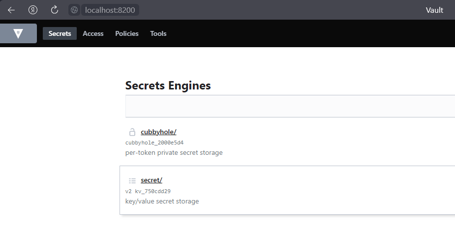

University: [ITMO University](https://itmo.ru/ru/) \
Faculty: [FICT](https://fict.itmo.ru) \
Course: [Introduction to distributed technologies](https://github.com/itmo-ict-faculty/introduction-to-distributed-technologies) \
Year: 2023/2024 \
Group: K4112с \
Author: Zinatov Rakhim Gamirovich \
Lab: Lab1 \
Date of create: 17.10.2023 \
Date of finished: 19.10.2023


### 1. Запуск minikube
    $ minikube start

### 2. Написание манифест файла для развертывания vault
Директория содержит в себе файл `vault.yaml`, в котором описана конфигурация развертывания пода vault и сервиса vault-service.  
Pod содержит информацию об использованном образе и порте сервиса vault и создает pod с нашим сервисом.  
Service управляет доступом к pod'у и позволяет перенаправлять на него запросы.

``` yaml
apiVersion: v1
kind: Pod                                            
metadata:
  name: vault
  labels:
    app: vault                         
spec:                                                
  containers:
    - image: vault:1.13.3 
      name: vault                             
      ports:
      - name: vault-port
        containerPort: 8200
        
---

apiVersion: v1
kind: Service
metadata:
  name: vault-service
  labels:
    app: vault  
spec:
  selector:
    app: vault
  type: NodePort
  ports:
    - port: 8200
      name: vault-port
      targetPort: vault-port
      protocol: TCP
```

### 3. Запуск Vault
#### Создаем под и сервис, используя написанный манифест:
    $ minikube kubectl -- create -f vault.yaml

#### Перенаправление запросов на pod
    $ minikube kubectl -- port-forward service/vault-service 8200:8200

#### Получение токена из логов vault
    $ minikube kubectl logs vault | findstr "Token"
    Root Token: hvs.RobxW4dDE9qYIiTrUK6rFnmd

#### Производим вход в Vault


### Схема
