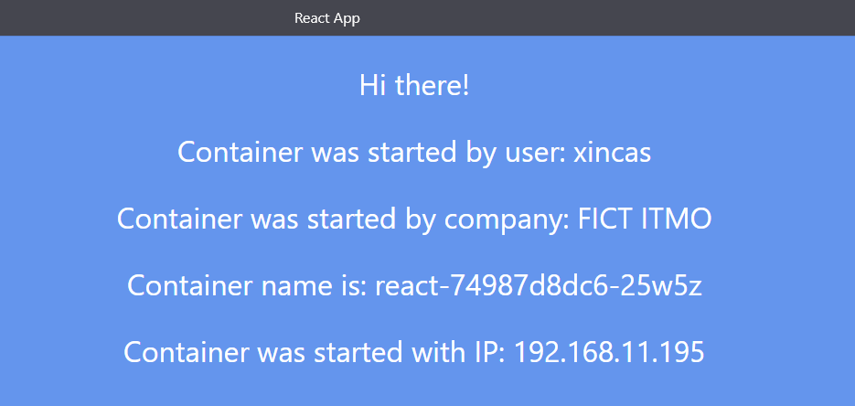
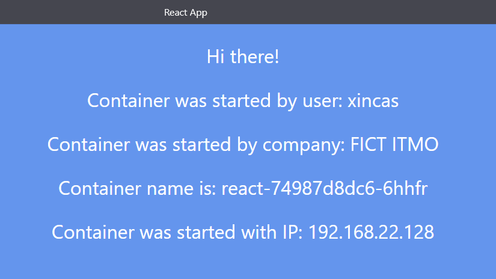
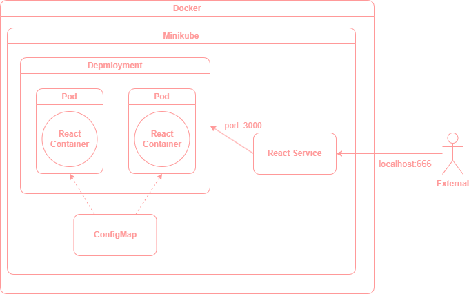

University: [ITMO University](https://itmo.ru/ru/) \
Faculty: [FICT](https://fict.itmo.ru) \
Course: [Introduction to distributed technologies](https://github.com/itmo-ict-faculty/introduction-to-distributed-technologies) \
Year: 2023/2024 \
Group: K4112с \
Author: Zinatov Rakhim Gamirovich \
Lab: Lab4 \
Date of create: 23.11.2023 \
Date of finished: <none>

## Устанавливаем `Calico` для Windows
    $ Invoke-WebRequest -Uri "https://github.com/projectcalico/calico/releases/download/v3.26.4/calicoctl-windows-amd64.exe" -OutFile kubectl-calico.exe
    $ copy .\kubectl-calico.exe 'C:\Program Files\Kubernetes\Minikube\'

## Запускаем 2 ноды `minikube` с `Calico`
    $ minikube start --network-plugin=cni --cni=calico --nodes 2 -p multinode

## Проверяем количество нод
    $ kubectl get nodes
```
NAME            STATUS   ROLES           AGE   VERSION
multinode       Ready    control-plane   8h    v1.27.4
multinode-m02   Ready    <none>          12s   v1.27.4
```

## Проверяем количество подов `calico`
    $ kubectl get pods -l k8s-app=calico-node -A
```
NAMESPACE     NAME                READY   STATUS    RESTARTS      AGE
kube-system   calico-node-bzttt   1/1     Running   2 (12m ago)   8h
kube-system   calico-node-cdc26   1/1     Running   2 (12m ago)   8h
```
## Укажем `label` для нод
    $ kubectl label node multinode rack=node-1 ; kubectl label node multinode-m02 rack=node-2
```
node/multinode labeled
node/multinode-m02 labeled
```

## Проверим указанные `label` для нод
    $ kubectl get nodes -l rack=node-2
```
NAME            STATUS   ROLES    AGE   VERSION
multinode-m02   Ready    <none>   13m   v1.27.4
```

## Создаем `Calico` манифест
``` yaml
apiVersion: projectcalico.org/v3
kind: IPPool
metadata:
  name: node-1-ippool
spec:
  cidr: 192.168.10.0/24
  ipipMode: Always
  natOutgoing: true
  nodeSelector: rack == "node-1"

---

apiVersion: projectcalico.org/v3
kind: IPPool
metadata:
  name: node-2-ippool
spec:
  cidr: 192.168.20.0/24
  ipipMode: Always
  natOutgoing: true
  nodeSelector: rack == "node-2"
```

## Удалим `IPPOOL` по умолчанию
    $ kubectl-calico delete ippools default-ipv4-ippool

## Применяем манифест
    $ kubectl-calico apply -f .\calico.yaml --allow-version-mismatch --config=calico.cfg.yaml
```
Successfully created 2 'IPPool' resource(s)
```

## Проверяем `IPPOOL`
    $ kubectl-calico get ippools --allow-version-mismatch
```
NAME            CIDR              SELECTOR
node-1-ippool   192.168.11.0/24   rack == "node-1"
node-2-ippool   192.168.22.0/24   rack == "node-2"
```

## Создаем `configMap`, `deployment` и `service`
``` yaml
apiVersion: v1
kind: ConfigMap
metadata:
  name: react-env
data:
  REACT_APP_USERNAME: "xincas"
  REACT_APP_COMPANY_NAME: "FICT ITMO"

---

apiVersion: apps/v1
kind: Deployment
metadata:
  name: react
spec:
  replicas: 2
  selector:
    matchLabels:
      app: react
  template:
    metadata:
      labels:
        app: react
    spec:
      containers:
        - name: react
          image: ifilyaninitmo/itdt-contained-frontend:master
          - name: react-port
            containerPort: 3000
          env:
            - name: REACT_APP_USERNAME
              valueFrom:
                configMapKeyRef:
                  name: react-env
                  key: REACT_APP_USERNAME
            - name: REACT_APP_COMPANY_NAME
              valueFrom:
                configMapKeyRef:
                  name: react-env
                  key: REACT_APP_COMPANY_NAME

---

apiVersion: v1
kind: Service
metadata:
  name: react-service
spec:
  type: LoadBalancer
  selector:
    app: react
  ports:
    - port: 666
      name: react-port
      targetPort: react-port
      protocol: TCP
```

## Применяем `deployment` и `service`
    $ kubectl apply -f dep.yaml

## Узнаем запущенные ноды
    $ kubectl get pods -o wide
```
NAME                     READY   STATUS    RESTARTS   AGE   IP               NODE            NOMINATED NODE   READINESS GATES
react-74987d8dc6-25w5z   1/1     Running   0          29s   192.168.11.195   multinode       <none>           <none>
react-74987d8dc6-6hhfr   1/1     Running   0          29s   192.168.22.130   multinode-m02   <none>           <none>
```

## Включаем туннелирование
    $ minikube service react-service -p multinode

## Приложение



## Container и Container IP
Они могут меняться, так как у нас есть два контейнера и `LoadBalancer` перенаправляет нас на один из них

## Узнаем имя соседнего пода
    $ kubectl exec react-74987d8dc6-25w5z -- nslookup 192.168.22.128
```
Server:         10.96.0.10
Address:        10.96.0.10:53

128.22.168.192.in-addr.arpa     name = 192-168-22-128.react-service.default.svc.cluster.local
```

## Ping соседнего пода
    $ kubectl exec react-74987d8dc6-25w5z -- ping 192-168-22-128.react-service.default.svc.cluster.local
```
PING 192-168-22-128.react-service.default.svc.cluster.local (192.168.22.128): 56 data bytes
64 bytes from 192.168.22.128: seq=0 ttl=62 time=0.385 ms
64 bytes from 192.168.22.128: seq=1 ttl=62 time=0.349 ms
64 bytes from 192.168.22.128: seq=2 ttl=62 time=0.206 ms
64 bytes from 192.168.22.128: seq=3 ttl=62 time=0.194 ms
```

## Схема
